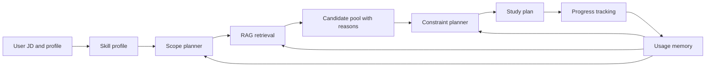

# DS Interview Planner Optimization Plan

## Goal

Upgrade this project from a local multi-agent prototype into an industrial-grade DS interview planning system.

The first version should work well in cold-start mode, without relying on existing user history. After users keep using the app, the system should naturally generate memory from their progress and use that memory to improve future plans.

Target product positioning:

> A cold-start RAG interview planner that improves through usage-generated memory.

## Current Framework

The current system has four main stages:

1. Agent 1 extracts skills from the job description and user profile.
2. Scope planner decides total question count, difficulty distribution, and skill quotas.
3. Retrieval agent searches local questions from the merged dataset.
4. Planning agent schedules retrieved questions into a day-by-day plan.

This structure is directionally good, but the implementation needs major improvement in data quality, retrieval logic, planning constraints, evaluation, and deployment.

## Main Problems

1. The current retrieval is not a full RAG system yet.
   It uses local embedding search, but it does not build a strong candidate pool from user intent, JD context, topic taxonomy, difficulty quotas, and question type constraints.

2. The theory knowledge base is too small and uneven.
   Coding questions are acceptable, but theory coverage is weak for statistics, probability, experimentation, causal inference, ML fundamentals, model evaluation, product analytics, and recommendation systems.

3. The retrieval query is too simple.
   It mainly searches by skill name. It should search using a richer query built from the JD, user request, target skill, role type, question type, difficulty target, and weak areas.

4. Planning loses important context.
   The planner currently receives a simple request like "Create a 7 day plan" instead of the full user profile, weak skills, selected candidate reasons, and scope constraints.

5. There is no usage-generated memory.
   This is acceptable for the first user session, but the product should start recording completions, confidence, skipped questions, weak skills, and review needs after the first generated plan.

6. There is no evaluation loop.
   Without test cases and metrics, it is hard to know whether retrieval or planning actually improved.

## Target Architecture



The first version should focus on the left-to-right cold-start flow. The memory loop should be implemented as a foundation, but it should not be required for the system to work.

## Key Modifications

### 1. Rebuild The RAG Knowledge Base

Unify all question records into one schema:

```json
{
  "id": "string",
  "type": "coding | theory",
  "category": "SQL | Pandas | Algorithms | ML | Statistics | Experimentation | Product",
  "title": "string",
  "question": "string",
  "answer": "string",
  "difficulty": "easy | medium | hard",
  "taxonomy_skills": ["string"],
  "source": "string",
  "url": "string"
}
```

Changes:

- Standardize `taxonomy_skill` vs `taxonomy_skills`.
- Standardize `vector_content` vs `vector_text`.
- Remove difficulty labels such as `algo_easy`, `algo_medium`, `sql_hard` from taxonomy skills.
- Keep difficulty only in the `difficulty` field.
- Add missing theory categories and rebalance topic coverage.
- Store source metadata for every theory question.

Recommended theory sources:

- [Google Machine Learning Crash Course](https://developers.google.com/machine-learning/crash-course): practical ML fundamentals, regression, classification, data quality, overfitting, and evaluation.
- [Stanford CS229 materials](https://cs229.stanford.edu/materials.html-full): ML theory, model selection, regularization, supervised learning, unsupervised learning, probability review.
- [An Introduction to Statistical Learning](https://www.statlearning.com/): regression, classification, resampling, regularization, tree models, SVM, unsupervised learning.
- [NIST Engineering Statistics Handbook](https://www.nist.gov/programs-projects/nistsematech-engineering-statistics-handbook): statistics, experimental design, process comparison, regression, reliability, uncertainty.
- [Trustworthy Online Controlled Experiments](https://experimentguide.com/): A/B testing, online experiments, metrics, validity, pitfalls, and experimentation platform concepts.
- [Microsoft Research Online Experimentation](https://www.microsoft.com/en-us/research/publication/online-experimentation-at-microsoft/): practical experimentation at scale.

Important: these sources should be used to design and validate interview-style questions. The dataset should not copy long source text verbatim.

### 2. Upgrade Retrieval Into Real RAG

Replace the current skill-name-only retrieval with a candidate generation pipeline.

New retrieval flow:

1. Build a rich retrieval query from:
   - target skill
   - JD keywords
   - user stated weak areas
   - role type
   - desired question type
   - target difficulty

2. Retrieve candidates using hybrid search:
   - taxonomy filter
   - semantic embedding search
   - keyword search
   - difficulty quota
   - coding/theory type quota

3. Rerank candidates using:
   - skill match score
   - semantic relevance
   - difficulty match
   - diversity penalty
   - source quality
   - previous completion penalty when memory exists

4. Return a candidate pool, not just final questions.

Candidate output should include:

```json
{
  "question_id": "string",
  "title": "string",
  "type": "coding | theory",
  "difficulty": "easy | medium | hard",
  "taxonomy_skills": ["string"],
  "retrieval_score": 0.0,
  "selection_reason": "why this question matches the user and JD"
}
```

### 3. Rewrite The Planner Around Constraints

The planner should not simply distribute questions by difficulty score. It should schedule questions under explicit constraints.

Core constraints:

- total days
- max questions per day
- daily estimated workload
- skill quotas
- difficulty distribution
- coding/theory ratio
- weak skills prioritized earlier
- hard questions not overloaded on one day
- repeated similar questions avoided
- final days include review and consolidation

Plan output should include:

- daily goal
- selected questions
- estimated time
- skill coverage
- difficulty mix
- short explanation
- review task if needed

The LLM should refine and summarize the plan, but deterministic logic should own the constraints.

### 4. Add Usage-Generated Memory

Do not assume existing user history. The first session should be cold-start.

After the first plan is generated, the app should start recording user behavior:

- assigned questions
- completed questions
- skipped questions
- replaced questions
- self-rated confidence
- wrong or weak skills
- review due dates
- company and JD snapshot

Recommended tables:

```text
users
prep_sessions
assigned_questions
question_attempts
skill_progress
review_queue
```

Memory should affect future plans by:

- avoiding already completed questions
- increasing difficulty when the user is consistently strong
- adding review when the user struggles
- prioritizing weak skills
- remembering previous prep sessions for the same company or similar JD

Memory is Phase 2. It should improve the system, not block the cold-start version.

### 5. Add Evaluation

Create a small evaluation set before making retrieval and planner changes.

Suggested eval cases:

- SQL-heavy product analyst JD
- ML-heavy data scientist JD
- experimentation and causal inference JD
- new grad general DS JD
- user strong in SQL but weak in ML theory
- user short on time
- user preparing for 7, 14, and 30 day timelines

Metrics:

- skill coverage
- difficulty quota error
- coding/theory ratio error
- duplicate rate
- empty day rate
- average retrieval relevance
- plan constraint violations
- explanation quality

The goal is not perfect automated grading. The goal is to prevent regressions when prompts, retrieval, or planning logic changes.

### 6. Deploy As A Real App

Recommended first deployment: GCP Cloud Run.

Why:

- Works well with Dockerized Streamlit or FastAPI apps.
- Can scale to zero for lower cost.
- Supports Secret Manager for API keys.
- Can later connect to Cloud SQL PostgreSQL with pgvector for RAG and memory.

Suggested GCP architecture:

```text
Cloud Run app
Cloud SQL PostgreSQL plus pgvector
Cloud Storage for dataset and embedding artifacts
Secret Manager for API keys
Cloud Build or GitHub Actions for CI/CD
```

Azure alternative:

```text
Azure Container Apps
Azure AI Search or Azure PostgreSQL plus pgvector
Azure Blob Storage
Azure Key Vault
GitHub Actions
```

Azure is also a strong choice if the project wants to highlight enterprise RAG and Microsoft ecosystem experience.

## First Version Implementation Order

1. Normalize the dataset schema and taxonomy.
2. Expand the theory knowledge base using reliable sources.
3. Build offline embedding artifacts.
4. Replace retrieval with hybrid RAG candidate generation.
5. Rewrite planner input and output contracts.
6. Add constraint-based scheduling.
7. Add basic progress tracking tables.
8. Add evaluation cases and metrics.
9. Prepare Docker and deploy to GCP Cloud Run.

## V1 Success Criteria

The first optimized version is successful if:

- It can generate a strong plan without user history.
- Retrieved questions clearly match the JD and user request.
- Theory questions are meaningfully represented.
- The plan respects difficulty, skill, and workload constraints.
- The system explains why each day is arranged that way.
- User progress can be recorded after plan generation.
- A second session can use recorded progress to avoid repeats and adjust difficulty.
- The app can be deployed to a cloud URL.

